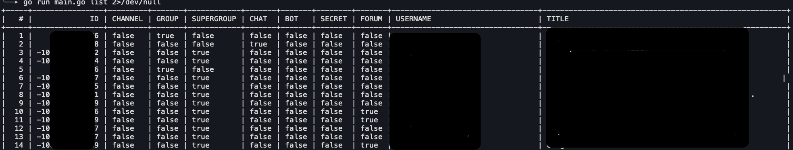

<br/>
<p align="center">
  <a href="https://github.com/Xumeiquer/tmd">
    
  </a>

  <h3 align="center">Telegram Media Downloader</h3>

  <p align="center">
    Download Telegram Media
    <br/>
    <br/>
    <a href="https://github.com/Xumeiquer/tmd"><strong>Explore the docs »</strong></a>
    <br/>
    <br/>
    <a href="https://github.com/Xumeiquer/tmd">View Demo</a>
    .
    <a href="https://github.com/Xumeiquer/tmd/issues">Report Bug</a>
    .
    <a href="https://github.com/Xumeiquer/tmd/issues">Request Feature</a>
  </p>
</p>

    

## Table Of Contents

- [Table Of Contents](#table-of-contents)
- [About The Project](#about-the-project)
- [Built With](#built-with)
- [Getting Started](#getting-started)
  - [Prerequisites](#prerequisites)
  - [Installation](#installation)
- [Usage](#usage)
- [Roadmap](#roadmap)
- [Contributing](#contributing)
  - [Creating A Pull Request](#creating-a-pull-request)
- [License](#license)
- [Authors](#authors)
- [Acknowledgements](#acknowledgements)

## About The Project



Telegram Media Downloader is a lightweight Telegram client and its only feature is download media files from chats, channels, forums, etc.

## Built With

This project is build using [zelenin](https://github.com/zelenin/go-tdlib) which is a [Go](https://go.dev) wrapper for the [Telegram Database Library](https://github.com/tdlib/td).

## Getting Started

Telegram Media Downloader is a command line application that runs inside a Docker container. The main reason is to ease the build process as well as the distribution of it.

### Prerequisites

You will need to [register an application](https://my.telegram.org/apps) in Telegram to obtain an `API_ID` and `API_HASH`, Telegram Media Downloader will need the API information to connect to Telegram on your behalf.
On the other hand, you need to have Docker installed to be able to execute Telegram Media Downloader.

You also need Docker to be installed on your system. Please go to [Docker install documentation](https://docs.docker.com/engine/install/) to see how Docker can be installed on your system.

### Installation

There is no installation as such. TMD is build on top of Docker so the unique thing required to do is pulling the TMD image.

```shell
> $ docker pull ghcr.io/xumeiquer/tmd
Unable to find image 'ghcr.io/xumeiquer/tmd:latest' locally
latest: Pulling from xumeiquer/tmd
07a64a71e011: Pull complete
fe5ca62666f0: Pull complete
b02a7525f878: Pull complete
fcb6f6d2c998: Pull complete
e8c73c638ae9: Pull complete
1e3d9b7d1452: Pull complete
4aa0ea1413d3: Pull complete
7c881f9ab25e: Pull complete
5627a970d25e: Pull complete
19cf2287de7f: Pull complete
ebba9ccde3ef: Pull complete
1933f300df8c: Pull complete
1bcbb926a265: Pull complete
Digest: sha256:dbcae7fa85a9bf6e709ba12f16193c7aa3b0d1b8a9774013eb4746f31da2adc4
Status: Downloaded newer image for ghcr.io/xumeiquer/tmd:latest
```

## Usage

```shell
> $ docker run --rm -it ghcr.io/xumeiquer/tmd --help
Download Telegram media from Users, Chats, Channels, or Forums.

Telegram Media Downloader allow users to download media content from Telegram cloud
without manually interacting with the Telegram client. Telegram Media Downloader is
or acts as a client so it has to be enrolled as a Telegram client.

Usage:
  tmd [command]

Available Commands:
  completion  Generate the autocompletion script for the specified shell
  download    Download media from the Telegram cloud
  help        Help about any command
  list        List information about conversations.

Flags:
  -h, --help               help for tmd
      --log-level string   set log level (info, error, warn, debug)
      --log-to string      where to log (default "stdout")
      --log-type string    log as text or JSON (default "json")
  -v, --version            version for tmd

Use "tmd [command] --help" for more information about a command.
```

## Roadmap

See the [open issues](https://github.com/Xumeiquer/tmd/issues) for a list of proposed features (and known issues).

## Contributing

Contributions are what make the open source community such an amazing place to be learn, inspire, and create. Any contributions you make are **greatly appreciated**.
* If you have suggestions for adding or removing projects, feel free to [open an issue](https://github.com/Xumeiquer/tmd/issues/new) to discuss it, or directly create a pull request after you edit the *README.md* file with necessary changes.
* Please make sure you check your spelling and grammar.
* Create individual PR for each suggestion.
* Please also read through the [Code Of Conduct](https://github.com/Xumeiquer/tmd/blob/main/CODE_OF_CONDUCT.md) before posting your first idea as well.

### Creating A Pull Request

1. Fork the Project
2. Create your Feature Branch (`git checkout -b feature/AmazingFeature`)
3. Commit your Changes (`git commit -m 'Add some AmazingFeature'`)
4. Push to the Branch (`git push origin feature/AmazingFeature`)
5. Open a Pull Request

## License

Distributed under the MIT License. See [LICENSE](https://github.com/Xumeiquer/tmd/blob/main/LICENSE.md) for more information.

## Authors

* **Xumeiquer** - *Project Owner* - [Xumeiquer](https://github.com/Xumeiquer)

## Acknowledgements

